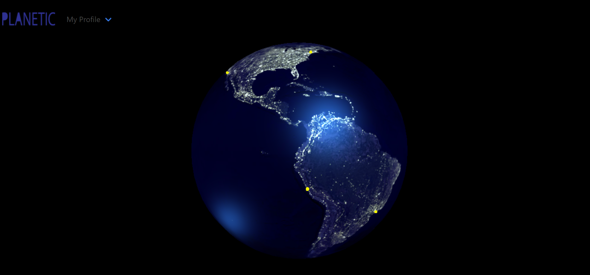

# Planetic

## Repo Link:

https://github.com/chronoslou/Planetic

## Heroku Link:

https://planetic.herokuapp.com/

# Description:

The following files contain the necessary assets to deploy the back-end for the travel social media application, Planetic. Planetic utilizes Node.js and Sequelize within the MVC paradigm to create user profiles, browse the globe for travel destinations, and engage with other users based on location. Planetic uses get and post routes to retrieve and add new data. Planetic also utilizes handlebars for formatting and the Bulma CSS framework. The rotating globe on the app homepage is using Three.js!

# Usage:

- User can create a profile and update email, password, home city, and add a pro tip!
- User can browse the globe on the homepage and visit the specific location of your choice.
- From there, user can visit the homepage of a specific city and engage with other users there, including reading posts from other users, commenting on those posts, and asking questions of their own!

# Installation:

- User should fork this repo, create a local clone, save and run on your machine!
- Run `npm i`, `npm install express`, `npm install sequelize`, `npm install env` to install dependencies.
- Update your .env file with the proper localhost, user and password data.
- Seed your database
- Run the data from the schema.sql in your MySequel Workbench
- run npm start to start your server

## Preview of App

## License

[MIT](https://choosealicense.com/licenses/mit/)
